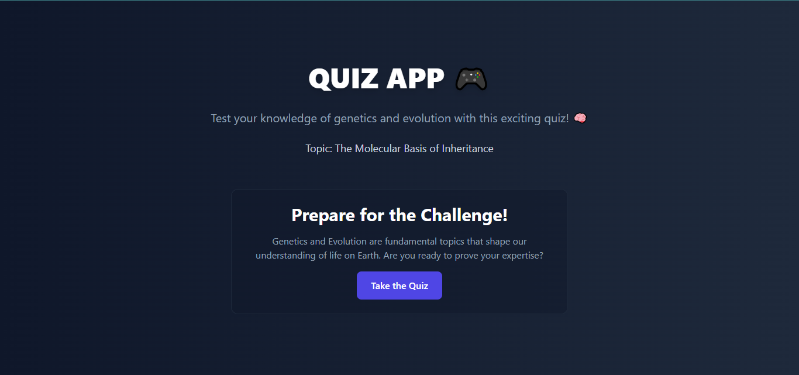
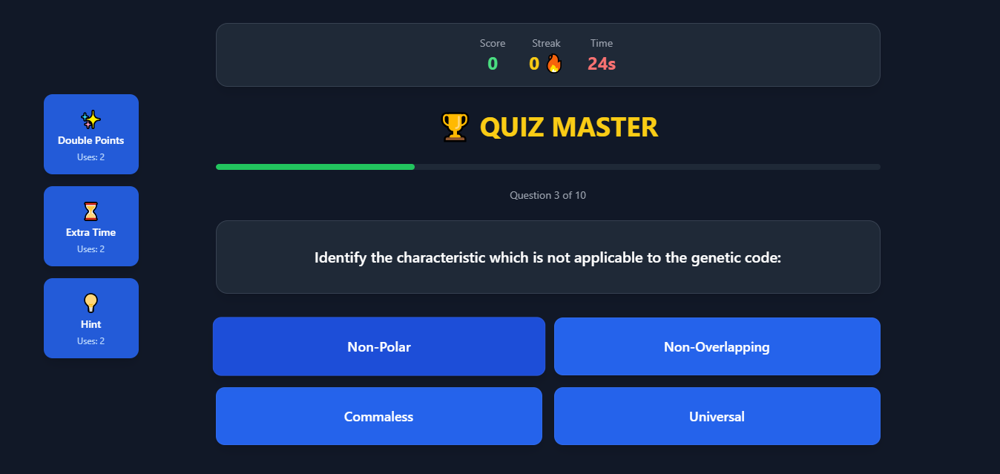
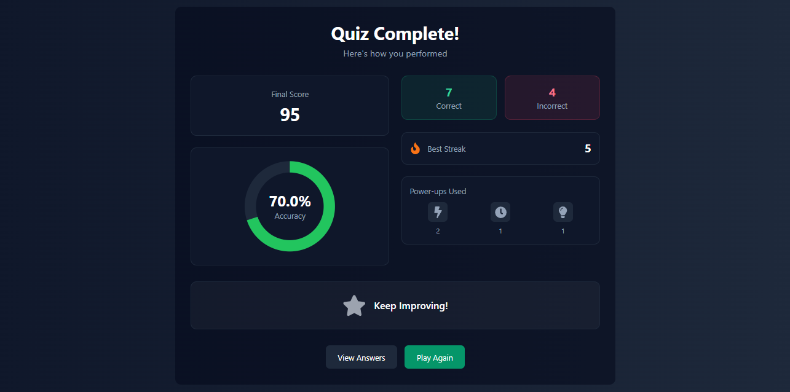

# Quiz Web App

## Overview
This project is an interactive quiz web application designed to test users' knowledge on various topics. The app features dynamic question fetching, scoring, and power-ups, providing an engaging experience for users. It includes features like extra time, hints, and double points to enhance the challenge.

## Features
- **Dynamic Questions**: Questions are fetched from an external API.
- **Timer**: A countdown timer for each question.
- **Power-Ups**: Includes power-ups such as extra time, hints, and double points.
- **Scoring System**: Points are awarded based on the correct answers, with additional points for streaks and power-ups.
- **Game Over**: Displays the final score after all questions are answered or the timer runs out.
- **Accuracy**: Shows the user’s accuracy percentage after completing the quiz.

## Installation

1. Clone the repository:
    ```bash
    git clone https://github.com/your-username/quiz-web-app.git
    ```

2. Navigate to the project directory:
    ```bash
    cd quiz-app
    ```

3. Install the required dependencies:
    ```bash
    npm install
    ```

4. Start the development server:
    ```bash
    npm start
    ```

5. Open the application in your browser:
    - Go to `http://localhost:3000` to start taking the quiz.





## Demo Video 🎥  
[Watch the Demo](https://www.youtube.com/watch?v=6nlLGD_8MSU)
## Usage
- Upon loading the homepage, you will see an introduction to the quiz.
- Start the quiz by clicking on the **Take the Quiz** button.
- Each question will present multiple-choice answers.
- Use power-ups like **Extra Time**, **Hint**, and **Double Points** to help answer questions.
- At the end of the quiz, your score and accuracy percentage will be displayed.

## Technologies Used
- **Frontend**: React.js, Tailwind CSS
- **State Management**: React Context API
- **Animation**: Framer Motion for smooth transitions and animations
- **API**: Fetching quiz data from a server

## Folder Structure

```bash
├── public/
├── src/
│   ├── components/  # Reusable React components
│   ├── contexts/    # Context API for global state management
│   ├── pages/       # Pages such as HomePage, QuizPage
│   ├── App.js       # Main React app file
│   └── index.js     # Entry point for the application
├── .gitignore
├── package.json
└── README.md
